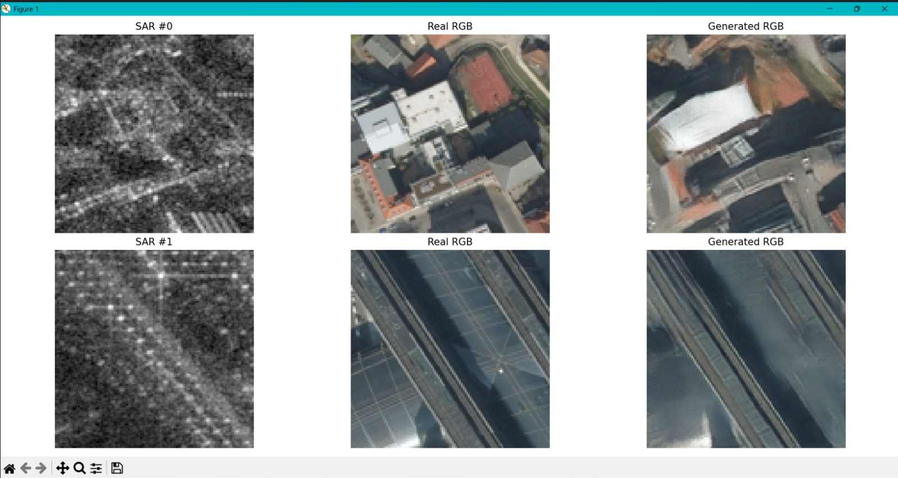

# SAR Image Colorization Using GAN

A deep learning project for **colorizing Synthetic Aperture Radar (SAR) images** by generating corresponding RGB/optical images using a **Pix2Pix Conditional GAN (cGAN)**.

The project learns the mapping:

**SAR Image → Generator (U-Net) → Generated RGB Image**

The generated image is compared with the corresponding real RGB image from the paired dataset.

---

## 📌 Project Overview

Synthetic Aperture Radar (SAR) images contain useful information about the Earth's surface but are generally represented in grayscale and can be difficult to interpret visually.

This project uses a **conditional Generative Adversarial Network (Pix2Pix)** to learn the relationship between SAR images and their corresponding optical/RGB images.

The goal is to generate an RGB-like representation from a SAR input while preserving important structures and visual information.

---

## 🎯 Objectives

- Convert SAR images into visually interpretable RGB images.
- Learn the SAR-to-optical mapping using paired image data.
- Use a Pix2Pix GAN architecture for conditional image-to-image translation.
- Compare generated RGB images with their corresponding real RGB images.
- Evaluate generated results using image-quality metrics such as **PSNR, SSIM, and FID**.

---

## 📊 Dataset

### SARPTICAL Dataset

The project uses the **SARPTICAL dataset**, which provides paired SAR and optical/RGB imagery.

Each training sample consists of:

| Data | Description |
|---|---|
| SAR Image | Input Synthetic Aperture Radar image |
| RGB Image | Corresponding optical/RGB target image |

The paired data allows the Pix2Pix model to learn a direct mapping between the SAR input and its corresponding RGB representation.

### Input Size

The images used by the model are processed to:

```text
112 × 112 pixels
```

> The dataset itself is not included in this repository because of its size. The repository contains the source code required to load and process the dataset.

---

## 🧠 Model Architecture

The project uses **Pix2Pix**, a Conditional Generative Adversarial Network designed for paired image-to-image translation.

### Generator

The **Generator** uses a **U-Net architecture**.

```text
SAR Image
    │
    ▼
Encoder
    │
    ├──── Skip Connections ────┐
    │                          │
    ▼                          │
Bottleneck                     │
    │                          │
    ▼                          │
Decoder ◄──────────────────────┘
    │
    ▼
Generated RGB Image
```

The skip connections help preserve spatial and structural information from the input SAR image.

### Discriminator

The **Discriminator** uses a **PatchGAN** architecture.

It evaluates local image patches instead of treating the complete image as a single unit. This helps encourage sharper and more realistic local details.

```text
SAR Image + RGB Image
          │
          ▼
       PatchGAN
          │
          ▼
  Real / Fake Patch Map
```

---

## 🔄 Training Workflow

```text
        SAR Image
            │
            ▼
       Data Loader
            │
            ▼
      U-Net Generator
            │
            ▼
      Generated RGB
            │
       ┌────┴────┐
       │         │
       ▼         ▼
   Discriminator  L1 Loss
       │
       ▼
 Adversarial Loss
       │
       └──────┬──────┘
              ▼
        Model Update
              │
              ▼
       Next Training Step
```

The model uses a combination of:

- **Adversarial Loss** to encourage realistic generated images.
- **L1 Loss** to keep the generated image close to the ground-truth RGB image.

---

## ⚙️ Technologies Used

- **Python**
- **PyTorch**
- **Torchvision**
- **NumPy**
- **Pillow**
- **OpenCV**
- **Matplotlib**
- **CUDA / GPU acceleration**

### Hardware Used

Training was performed using GPU acceleration, including:

- NVIDIA T4 GPU
- NVIDIA GeForce RTX 2050

---

## 📁 Project Structure

```text
SAR-Image-colorization-Using-GAN/
│
├── train.py
├── generator.py
├── discriminator.py
├── dataset_loader.py
├── dataset_test.py
├── dataloader_test.py
├── generate_results.py
├── test_gpu.py
├── .gitignore
├── README.md
└── results_comparison.png
```

The following are intentionally excluded from the repository:

```text
datasets/
venv/
new code/
old code/
*.pth
__pycache__/
```

---

## 🚀 Installation

### 1. Clone the repository

```bash
git clone https://github.com/bhoominyn25-code/SAR-Image-colorization-Using-GAN
cd SAR-Image-colorization-Using-GAN
```

### 2. Create a virtual environment

```bash
python -m venv venv
```

### 3. Activate the environment

**Windows:**

```bash
venv\Scripts\activate
```

### 4. Install dependencies

```bash
pip install torch torchvision numpy Pillow opencv-python matplotlib
```

---

## ▶️ Running the Project

### Test GPU availability

```bash
python test_gpu.py
```

### Test the dataset

```bash
python dataset_test.py
```

### Test the data loader

```bash
python dataloader_test.py
```

### Train the Pix2Pix model

```bash
python train.py
```

### Generate results

```bash
python generate_results.py
```

> Make sure the dataset path configured in the project points to your local SARPTICAL dataset before training or generating results.

---

## 📈 Evaluation Metrics

The generated images can be evaluated using:

### PSNR
**Peak Signal-to-Noise Ratio** measures the similarity between the generated image and the ground-truth image. Higher PSNR generally indicates lower pixel-level reconstruction error.

### SSIM
**Structural Similarity Index** measures similarity in structural information, luminance, and contrast between images.

### FID
**Fréchet Inception Distance** compares the distributions of generated and real images using feature representations. Lower FID generally indicates closer feature distributions.

---

## 🖼️ Results

The following comparison shows:

**SAR Input → Real RGB → Generated RGB**



The examples demonstrate the model's ability to generate RGB representations from SAR inputs while retaining major spatial structures present in the corresponding optical images.

---

## 🔬 Example Output

### Sample 1

- **SAR #0:** Input SAR image
- **Real RGB:** Ground-truth optical image
- **Generated RGB:** RGB image produced by the trained Pix2Pix generator

### Sample 2

- **SAR #1:** Input SAR image
- **Real RGB:** Ground-truth optical image
- **Generated RGB:** RGB image produced by the trained Pix2Pix generator

---

## 🔮 Future Improvements

- Improve fine-grained color reconstruction.
- Experiment with perceptual loss and feature-based losses.
- Improve texture and edge preservation.
- Tune Generator and Discriminator learning rates.
- Experiment with different GAN architectures.
- Evaluate results over larger and more diverse SAR scenes.

---

## 👨‍💻 Project

**SAR Image Colorization Using GAN**

**Model:** Pix2Pix Conditional GAN  
**Generator:** U-Net  
**Discriminator:** PatchGAN  
**Dataset:** SARPTICAL  
**Input:** SAR images  
**Output:** Generated RGB/optical images

---

## 📜 License

This project is intended for academic and research purposes.
